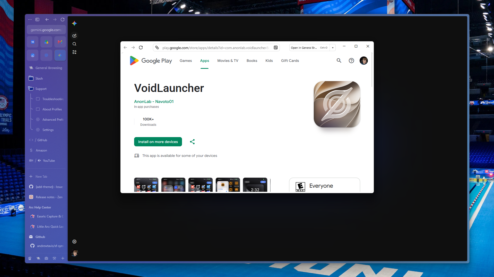

# Little Zen

A Zen Browser chrome mod that backports and experiments with Little Zen windows: small floating browser windows that can open live tabs, route links through Zen spaces and containers, and move the loaded tab back into the selected space.

## Features

- Opens compact Little Zen windows from normal Zen browsing flows.
- Delays routed URL loads until the target space/container is known.
- Preserves live tabs when moving them back into the main Zen window.
- Adds a native-feeling `Open in Space` control with searchable space selection.
- Adapts the Little Zen frame, URL bar, page shadow, and transparent browser styling to the active page/theme.
- Shows a compact stalled-load fallback if the blank loading state lasts too long.

## Debugging

Set `extensions.littleZen.debugRouting` to `true` in `about:config` to enable verbose space/container routing logs. The pref defaults to `false`.

## Install

Copy this folder into your Zen profile's `chrome/sine-mods` directory, then enable or reference the mod from your local `mods.json` setup. Restart Zen after changing chrome scripts or styles.

This mod targets Twilight-style Zen profile chrome loading and may need adjustment as upstream Little Zen support changes.
